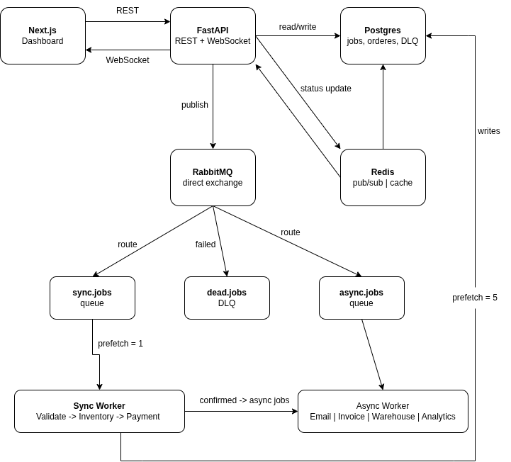

# OrderFlow — Distributed Order Processing System

I built this to understand how real e-commerce backends handle the gap between "user clicks buy" and "order is confirmed." Not the frontend part — the infrastructure underneath it. The part that answers "what happens when payment fails?" and "how do you make sure two people can't buy the last item at the same time?"

The system processes orders through two phases: a synchronous critical path (validate cart → reserve inventory → process payment) and an asynchronous background phase (email confirmation, invoice generation, warehouse notification, analytics update). Both phases run as separate workers consuming from RabbitMQ queues.

---

## Architecture



## How it works

```
User places order
      ↓
FastAPI → PostgreSQL (order created) → RabbitMQ sync queue
      ↓
Sync Worker: validate cart → reserve inventory → process payment
      ↓
RabbitMQ async queue (4 jobs fired in parallel)
      ↓
Async Worker: email + invoice + warehouse + analytics
      ↓
Redis pub/sub → WebSocket → browser (live status updates)
```

**FastAPI** (`services/api/main.py`) handles REST endpoints and WebSocket connections. On startup it declares all RabbitMQ exchanges and queues with dead letter routing configured. Orders are created in PostgreSQL and immediately published to the sync queue.

**Sync Worker** (`services/workers/sync_worker.py`) processes one job at a time with `prefetch_count=1`. Each job goes through three sequential steps — cart validation, inventory reservation, payment processing. Uses PostgreSQL row-level locking (`SELECT FOR UPDATE`) during inventory reservation to prevent race conditions when two orders compete for the last item.

**Async Worker** (`services/workers/async_worker.py`) processes up to five jobs concurrently with `prefetch_count=5`. After payment confirms, four async jobs fire in parallel using `asyncio.create_task` — no reason to wait for email before starting invoice generation.

**Redis** handles two things: WebSocket pub/sub (status updates published on every state change, picked up by the WebSocket endpoint and pushed to the browser) and is available for caching if needed.

**RabbitMQ** routes jobs through a direct exchange with two queues — `sync.jobs` for the critical path and `async.jobs` for background work. Both queues have a dead letter exchange configured so failed messages route to `dead.jobs` automatically.

**Next.js dashboard** connects to the WebSocket on order creation and updates the status badge in real time without polling.

---

## Schema

The most important design decision was the jobs table. Every background task — sync or async — is a row with `attempts`, `max_attempts`, `status`, and `error_message`. This gives you a full audit trail of what happened to every order, which failed steps were retried, and what ended up in the dead letter queue.

| Table | Purpose |
|---|---|
| `orders` | Order lifecycle — status moves from pending to fulfilling |
| `products` | Inventory with stock counts decremented on reservation |
| `order_items` | Line items with price at time of purchase |
| `jobs` | Every background task with retry tracking |
| `dead_letter_queue` | Permanently failed jobs with error context |

---

## Key design decisions

**Why sync and async workers are separate processes**

The sync worker uses `prefetch_count=1` because cart validation, inventory reservation, and payment must run sequentially — you can't charge the customer before reserving stock. The async worker uses `prefetch_count=5` because email, invoice, warehouse notification, and analytics are completely independent and should run in parallel.

**Row-level locking for inventory**

Two users buying the last item simultaneously is a classic race condition. The fix is `SELECT * FROM products WHERE id=$1 FOR UPDATE` inside a transaction — PostgreSQL locks the row for the first transaction, the second waits. Only one order gets the last unit.

**Exponential backoff on payment failures**

Payment gateways fail transiently. The retry logic uses `2 ** attempts` seconds delay — 2s, 4s, 8s — before nacking the message back to RabbitMQ. After `max_attempts` (default 3), the job routes to the dead letter queue and the order is marked failed.

**Dead letter queue as first-class citizen**

Every queue has `x-dead-letter-exchange` configured at declaration time. Failed messages route automatically — no manual DLQ logic needed in the worker. The `dead_letter_queue` table captures the payload and error for inspection.

---

## Running locally

You need Docker and Docker Compose installed.

```bash
git clone https://github.com/SanketJanger/OrderFlow---A-Distributed-Order-Processing-System.git
cd OrderFlow---A-Distributed-Order-Processing-System
docker compose up --build
```

All six services start in dependency order — PostgreSQL and Redis first, then RabbitMQ, then the API and workers once all three are healthy. The migration runs automatically on first startup.

```bash
# API
http://localhost:8000

# RabbitMQ management UI
http://localhost:15672  (user: orderflow / pass: orderflow123)

# Frontend
cd frontend && npm install && npm run dev
http://localhost:3000
```

---

## API

| Method | Endpoint | Description |
|---|---|---|
| GET | `/health` | Pipeline status — total orders, jobs, DLQ count, service reachability |
| GET | `/products` | All products with current stock |
| POST | `/orders` | Create order — validates products, queues sync job |
| GET | `/orders` | List all orders |
| GET | `/orders/:id` | Order detail with all jobs and line items |
| POST | `/orders/:id/cancel` | Cancel pending or queued order |
| WS | `/ws/:order_id` | Real-time status stream for an order |

---

## What I learned building this

The hardest part wasn't the queue logic — it was startup ordering. Workers connecting to RabbitMQ before the API had declared the exchanges caused silent failures. The fix was making each service declare its own exchanges and queues idempotently on startup. RabbitMQ's `durable=True` declarations are idempotent, so multiple services declaring the same queue is safe.

`prefetch_count` matters more than I expected. Without it, RabbitMQ pushes all queued messages to the first available worker, which defeats the purpose of having multiple workers. Setting it to 1 on the sync worker ensures fair distribution — each worker takes one job, processes it, then takes the next.

The WebSocket + Redis pub/sub pattern is clean. Every status change publishes to `order:{id}` in Redis. The WebSocket endpoint subscribes to that channel and forwards messages to the browser. The frontend never polls — it just listens.

---

## Stack

Python · FastAPI · PostgreSQL · RabbitMQ · Redis · asyncpg · aio-pika · Next.js · TypeScript · Docker Compose
